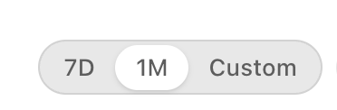

# TODOs

This file collects product and implementation TODOs from working sessions. Move items into `ROADMAP.md`, `PRODUCT.md`, or `DECISIONS.md` when they become stable plans.

## Recently Completed

- Default "Individual" project seeded on first sign-in: `loadProjects` checks for empty projects list and inserts a default "Individual" project so new users always have a project to route tasks to.
- Default "Individual" project seeded on first sign-in: `loadProjects` checks for empty projects list and inserts a default "Individual" project so new users always have a project to route tasks to.

- Resources tab: workspace tab showing per-member workload — active tasks, overdue, due today, urgent. Reads from existing todos and members state; no new schema needed.
- Dashboard tab: workspace tab with a 6-stat grid (Active, Overdue, Due Today, Due This Week, Done This Week, Urgent), team member workload chips, and inline overdue/due-today task lists. Context-aware: reflects personal or team todos depending on what's loaded.
- Auth flow improvements: app logo/brand header, display name field on sign-up (saved to `profiles.display_name`), email format validation, password length check (≥8 chars) on sign-up, "Show/Hide" password toggle, success confirmation box (green) instead of red text, password-reset screen matches new design, social OAuth buttons visually disabled with "coming soon" label, footer with terms note.
- Personal workspace remains usable without creating a team.
- Todo priority levels: low, normal, high, urgent.
- New todos default to Normal priority.
- Priority is changed from each todo row, not during todo creation.
- Relative timestamps are shown on todo rows, including Personal workspace todos.
- Due dates are optional for personal and team todos.
- Due dates are set from each todo row instead of the add-todo input area.
- Todo annotations are a future per-task detail feature.
- `docs/` is the project documentation home.
- Future Outlook Calendar and Google Calendar integration is documented.
- Workspace switching uses tabs for Personal, with Projects planned.
- Teams and Organizations live under the account/admin menu.

## Personal Workspace

- **Project assignment icon on task rows** — in Personal view, add a small icon/button on each todo row to assign it to a project. Tapping opens a compact picker listing existing projects. Preferred over a global pill row above the task list (removed — too prominent for an optional field). The icon should be subtle when no project is assigned and show the project name/initial when one is set.

- In the Personal workspace header/toolbar, add a toggle button with tooltip "Show personal items" that filters the list to todos belonging to the user's personal account (not assigned from other workspaces, not team todos). Useful when the inbox is crowded and the user just wants to focus on their own private work.
- The filter should be remembered per session (or persisted in user prefs). A filled/highlighted icon indicates the filter is active.
- Consider pairing with a complementary "Show assigned" toggle so users can quickly switch between personal-only, assigned-only, and all.

## Resources View

**Current (implemented):** Read-only workload overview tab showing each team member's active task count, overdue count, due-today count, and urgent count. Reads from in-memory todos and members — no new API calls.

**Next steps:**

- Add a capacity indicator: estimated hours remaining vs. capacity per person. Requires `estimated_time` on todos (already in near-term plan).
- Add a timeline row per member: mini bar showing tasks sorted by due date, highlighting overdue in red.
- Show project breakdown per member: group assigned tasks by project.
- Allow the resource view to be filtered by team or project when multiple teams are loaded.
- Add a "workload balance" warning when one member has significantly more urgent/overdue tasks than others.
- Future: resource scheduling — assign tasks directly from the resource view by dragging into a member's row.
- Future: capacity planning — set weekly hour capacity per member; surface when capacity is exceeded.

## Dashboard View

**Current (implemented):** Stat grid + team workload chips + overdue/due-today task lists. Renders from in-memory state; auto-refreshes with the rest of the app.

**Near-term:**

- Add a "Done this month" stat card.
- Add a sparkline or bar chart for task completion trend over the last 7 days.
- Add a "next milestone" banner if a project milestone is due within 7 days.
- Add project health summary cards when projects are loaded.

**Custom dashboards (future — user creates their own):**

- Allow a user to create a named dashboard and choose which widgets appear on it.
- Widget types (phase 1): Stat counter (any metric), Task list (filtered by priority/assignee/project), Member workload grid, Milestone countdown.
- Widget types (phase 2): Activity feed, Notes widget, Team status board, Chart widget.
- Dashboards can be scoped to: personal, a team, a project, or a custom group of users.
- A "group of users" dashboard lets a manager or org owner see aggregated workload across multiple teams or projects in one view — useful for portfolio management.
- Schema: `dashboards` (id, owner_id, name, scope_type, scope_id, created_at), `dashboard_widgets` (id, dashboard_id, widget_type, config jsonb, position, created_at). Widget config holds filter params and display options.
- Sharing: dashboards can be shared read-only with a team or org. Edit rights stay with the owner.
- Dashboards are a candidate for a paid tier feature for teams with 5+ members.

## Auth UX

- **"Continue as [Name]"** — when a returning user hits the login screen, detect the previously signed-in account (from local storage / last session) and surface a single-tap "Continue as [Name]" button with their avatar and email, similar to ClickUp and Google's account-picker pattern. Eliminates re-typing credentials for the common case. Falls back to the full email+password form if dismissed or if no prior session exists.
- The button should show: avatar (photo > animal emoji > initials), display name, and email. A chevron or "switch account" link lets the user pick a different account instead.
- For OAuth accounts (Google, Apple, GitHub), tapping "Continue as" re-triggers the same OAuth flow silently if the provider session is still valid, or opens the provider picker if not.
- Store the last-used identity hint (display name, avatar URL, email, auth method) in `localStorage` / `AsyncStorage` — NOT a credential. Clear it on explicit sign-out.

## Design System

- **UI Element Design Principles** — document visual and interaction design principles for each recurring UI element type to guide consistent implementation and future decisions. Candidates: row items (task, inbox, completed), section headers, action buttons, pills/badges, modals/cards, tooltips, input fields, avatar chips, priority indicators, due date pills. For each: define spacing, typography, color, interaction state (hover/active/disabled), and the intent behind the choices. Goal is a living reference that prevents element-by-element ad-hoc decisions and makes new panels/views self-consistent from the start.

- **Text truncation with `...` (ellipsis) — learn from this pattern.** When a row has multiple fixed-width elements competing for space (text, context label, date, avatar), `numberOfLines={1}` can produce very short clips like "E…" that destroy meaning. Rules to follow: (1) Text is primary — give it `flex: 1` and let fixed elements shrink before the text does. (2) Secondary metadata (context label, date) should use `flexShrink: 1` with a `maxWidth` cap so they yield space to the text. (3) Never let a truncated label be shorter than ~3–4 characters — if it would be, hide it entirely rather than show a useless fragment. (4) On hover/tap of a truncated row, show the full text in a tooltip or expanded state. (5) Audit compact row layouts (Inbox, Assigned, Completed side panels) specifically — they are most likely to have this problem because they squeeze many columns into a narrow panel width.

## Near-Term

- Keep add-todo quick capture limited to a single todo text input.
- Add schema-backed Organization creation from the account menu.
- Add schema-backed Project creation from the workspace `+` menu.
- Keep a default `Project 1` workspace tab visible as the first planned project surface until schema-backed projects exist.
- Add Profile editing so users can set or change their display name.
- Add due-date views for overdue, due soon, today, and unscheduled work.
- Track `completed_at` and show completed date near the due date for completed todos.
- Add team invitations when adding an email that does not yet belong to a user profile.
- Add a Notes area under the todo list as a separate concept from todo annotations.
- Add a Team Page for shared notes, links, status, and lightweight widgets.
- Add filters for urgent, assigned to me, created by me, active, and completed.
- Add empty states for Personal and Team workspaces.
- Add a Trash for deleted todos so items can be recovered before permanent deletion.
- Define paid feature boundaries while keeping personal and small-team use free.
- Add Communications as a future concept for personal messaging, team chat, and lightweight coordination.
- Add default assignment notifications, plus read state and acknowledgement responses as a project-management communication workflow.
- Add UI customization as a future business feature for personal themes, team branding, company logos, and color choices.
- Add choices for todo list item spacing, such as compact, comfortable, and spacious density modes.

## Team Pages

- Create a shared, co-editable team homepage for each team.
- Support simple sections such as notes, links, status, upcoming work, pinned todos, and team calendar preview.
- Treat Team Pages as an internal shared workspace, not as an embedded Google Doc or Sheet.
- Use realtime sync so team members can co-edit and see updates quickly.
- Decide whether Team Pages need edit history, section-level permissions, or conflict handling before adding rich editing.

## Notes

- Treat Notes as a separate workspace concept, not as the same thing as todo annotations.
- Place the Notes area under the todo list in the initial UI.
- Consider moving Notes into its own tab after workspace tabs exist.
- Support quick note taking for personal, team, or project context depending on the active workspace.
- Keep annotations scoped to one task; keep Notes for broader context, thoughts, snippets, and running notes.

## Todo Annotations

- Add annotations as a future per-todo feature.
- Use annotations for task-specific details, comments, clarifications, and context.
- Keep annotations attached to exactly one todo item.
- Do not use workspace Notes for task-specific annotation.

## Assignment & Collaborators

- Replace the cycle-tap assignee mechanic on kanban cards with a searchable picker modal.
- Picker shows Team Members first (from the project's linked team), then any existing Collaborators on the project.
- Search filters by name or email in real time; Tab moves between results; Enter confirms selection.
- "Add by email" option at the bottom invites a new Collaborator without leaving the task.
- Schema: add a `project_collaborators` table (project_id, user_id, invited_by, created_at) distinct from `team_members`. Collaborators get scoped RLS access — only the tasks assigned to them and their required project context.
- Collaborators appear only on the tasks they are assigned; they do not appear in the team member panel.
- Both Team Members and Collaborators receive assignment notifications; Collaborators may need email delivery since they may not have the app.

## Project Kanban View

- Backlog strip (one-line capture bar above phase columns). ✓ Done.
- Phase columns with date ranges and per-column task input. ✓ Done.
- KanbanCard component with priority badge, due date, and assignee pill. ✓ Done.
- Drag and drop tasks between Backlog and phase columns (web: @dnd-kit; native: react-native-draggable-flatlist).
- Drag and drop to reorder tasks within a column.
- Done tasks collapsed/hidden by default per column, expandable on tap.
- Card detail view: tap a card to open full task detail inline (note, checklist, attachments) without leaving kanban.
- Column WIP indicator: optional soft limit on active tasks per phase — visual warning, not a hard block.
- Phase completion gate: when marking a phase complete, prompt to move or close any remaining open tasks.
- Enforce 5-phase maximum. ✓ Done.

## Project Management

- Add projects as bounded work that can end or close. ✓ Done.
- Add project-scoped todos. ✓ Done.
- Add project phases for lifecycle planning. ✓ Done.
- Use due dates for project planning, milestone tracking, and schedule visibility.
- Add `is_milestone` flag to todos; milestone todos render distinctly (diamond icon, delivery-event completion, countdown when near due date).
- Surface overdue milestone todos prominently on the project screen; show next-milestone countdown banner.
- Critical path: highlight todos in the active phase with due dates before the nearest upcoming milestone todo.
- Add a project health view: current phase, overdue items, next milestone countdown, blocked items — all in one screen.
- Add project closure with a summary: phases completed, todos completed vs dropped, milestones hit or missed.
- Add project schedule views after phases, milestones, dependencies, and due dates are modeled.
- Track resource constraints and risk notes through todo annotations and project planning/annotation.
- Add project lifecycle states such as active, paused, completed, and closed. ✓ Done (schema).
- Show projects as workspace tabs when a user enters or pins a project. ✓ Done.
- Decide the project rename flow; prefer project planning/settings over double-click so it works on iPhone and can include phases, milestones, status, and schedule planning.

## Calendar Integration

- Add a Personal Calendar for personal todos, assigned todos, reminders, and personal schedule context.
- Add a Team Calendar for team-visible tasks, recurring team duties, and project milestones.
- Let team leaders create recurring tasks on the Team Calendar.
- Design recurrence rules for daily, weekly, monthly, and custom schedules.
- Model reminders and project milestones before connecting calendar providers.
- Keep Outlook Calendar and Google Calendar sync optional per user.
- Make calendar sync explicit per todo or project milestone to avoid noisy calendars.
- Decide how team calendar items sync to external calendars without exposing private team data.

## Team Management

- Keep teams ongoing/perpetual.
- Design team invitation acceptance and expiration.
- Add roles and permissions beyond owner/admin/member only when needed.

## Profile & Avatar

- Onboarding avatar step: offer (1) import from LinkedIn, (2) upload a photo, (3) choose an animal emoji. LinkedIn import is the encouraged path — users already have a professional photo there and it reduces friction. See `docs/DECISIONS.md` for the full onboarding design.
- LinkedIn import: use LinkedIn OAuth to fetch the profile photo and optionally display name and job title. Cache the photo to Supabase Storage (`avatars/{user_id}`) to avoid CDN dependency.
- Photo upload: store in Supabase Storage; write public URL to `profiles.avatar_url`. Support crop/resize on upload.
- Keep the animal emoji picker as a fun fallback for users who prefer not to use a photo.
- Display priority throughout the app: profile photo > animal emoji > initials fallback.
- Show the avatar consistently everywhere: title bar, assignment pills, inbox rows, member panels, and team pages.
- Add a Profile screen where users can change display name, avatar, status, and other profile fields after onboarding.

## Status & Presence

- Phase 1 (done): Users set their own status text from the title bar; stored in `profiles.status`; visible only to themselves for now.
- Phase 2: Team members who opt in to sharing see each other's statuses — surface on hover/tap of a member chip in the member panel, not in the title bar.
- Future: Team leaders (owner/admin role) can push a broadcast message into the status bar area that all team members see and must acknowledge (read-receipt style). This replaces the "announcement" use-case without requiring a full chat feature. Treat acknowledgement as a lightweight team communication primitive before building full notifications.

## Communications

- Treat Communications as a future product concept for personal messaging, team chat, todo/project discussion, and notifications.
- Keep initial communication features lightweight so they support coordination without distracting from task and project management.
- Trigger an app UI notification by default when a task is assigned.
- Treat read state and acknowledgement as assignee responses to implement after basic notifications.
- Let the assigner choose later whether an assignment also requests acknowledgement or uses email/text delivery.
- Use acknowledgements to confirm that an assignee has accepted important work.
- Decide later whether discussion belongs directly on todos/projects, in team channels, or both.

## Customization

- Let users, teams, and companies customize logos, colors, and workspace appearance.
- Keep customization constrained enough to preserve usability, accessibility, and recognizable app behavior.
- Consider advanced branding as a paid feature for companies or larger teams.
- Add built-in skins/themes (e.g. light, dark, high-contrast, color accents) for users to choose from without requiring custom branding.
- Keep theme selection as a personal preference; team or company branding can override or extend it.
- **Display Density** — add a density picker (Compact / Cozy / Roomy) similar to Outlook's Display Density menu. Controls `paddingVertical` on all rows and section headers. Compact: 4px vertical. Cozy: 7px (current default). Roomy: 12px. The chosen value replaces the `micro` spacing token at runtime and applies uniformly to every row in every pane (tasks, completed, inbox). Persist the selection in user prefs. Show a checkmark next to the active choice like Outlook does.

this is a good UI element to have.
